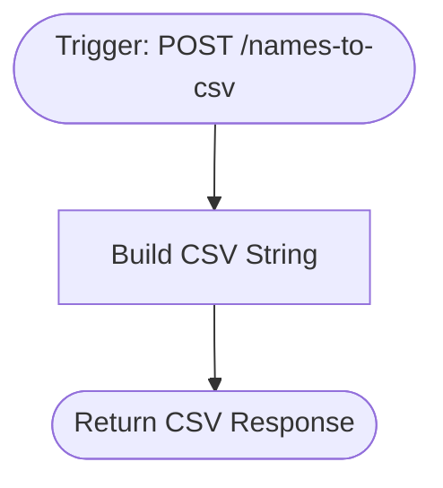

# context.md — API - Convert Names Emails - CSV Response

## Purpose
This workflow removes the need to manually format lists of names and emails into CSV files. Any system or team member can POST a JSON array of contacts and receive a ready-to-use CSV string back in the same response.

## What It Does
1. Listens for an incoming HTTP POST request at the `/names-to-csv` webhook path.
2. Reads the JSON body, which should contain an array of objects with `name` and `email` fields.
3. Validates that the payload contains a non-empty array; returns an error message in the CSV field if not.
4. Builds a properly formatted CSV string with a `name,email` header row, quoting all field values and escaping any embedded double-quotes.
5. Returns the CSV string directly in the HTTP response with a `text/csv` Content-Type header and a 200 status code.

## Workflow Diagram

> Diagram auto-generated from workflow node graph at submission time.

## Tools & Connectors Used
| Tool / Service | How It's Used |
|---|---|
| Webhook | Receives the incoming POST request containing the names and emails JSON payload |

## Credentials Required
| Credential Name | Service | Notes |
|---|---|---|
| None | — | This workflow requires no credentials — the webhook endpoint is unauthenticated |

## KPI Baseline
| Metric | Value |
|---|---|
| Manual time per run (before) | 13 minutes |
| Estimated runs per week | 7 |
| Projected hours saved/week | (13 × 7) / 60 = 1.52 hours |

## Risk Self-Assessment
| Risk Type | Present? | Notes |
|---|---|---|
| Handles PII / personal data | Yes | Processes names and email addresses submitted in the payload; no data is stored or forwarded |
| Makes external API calls | No | All processing is internal; no outbound API calls |
| Involves financial data | No | No financial data involved |
| Requires human decision point | No | Fully automated input-to-output transformation |
| Shared automation modification | No | Original build; not cloned or modified from an existing automation |

## Submitter
**Name:** Vishal Mishra
**Email:** vishalm.mishra@fulcrumapp.com
**Date:** 2026-06-19
**n8n Workflow ID:** 2DEXfAJcznLM2f5j
**Registry ID:** 2c14d702-cdb7-4f44-9b23-f3c5527ed84d
**COE Portal:** https://coe-portal.ai.fulcrum.tools/catalog/2c14d702-cdb7-4f44-9b23-f3c5527ed84d
**Instance:** fulcrumtest.app.n8n.cloud
**Source:** Original