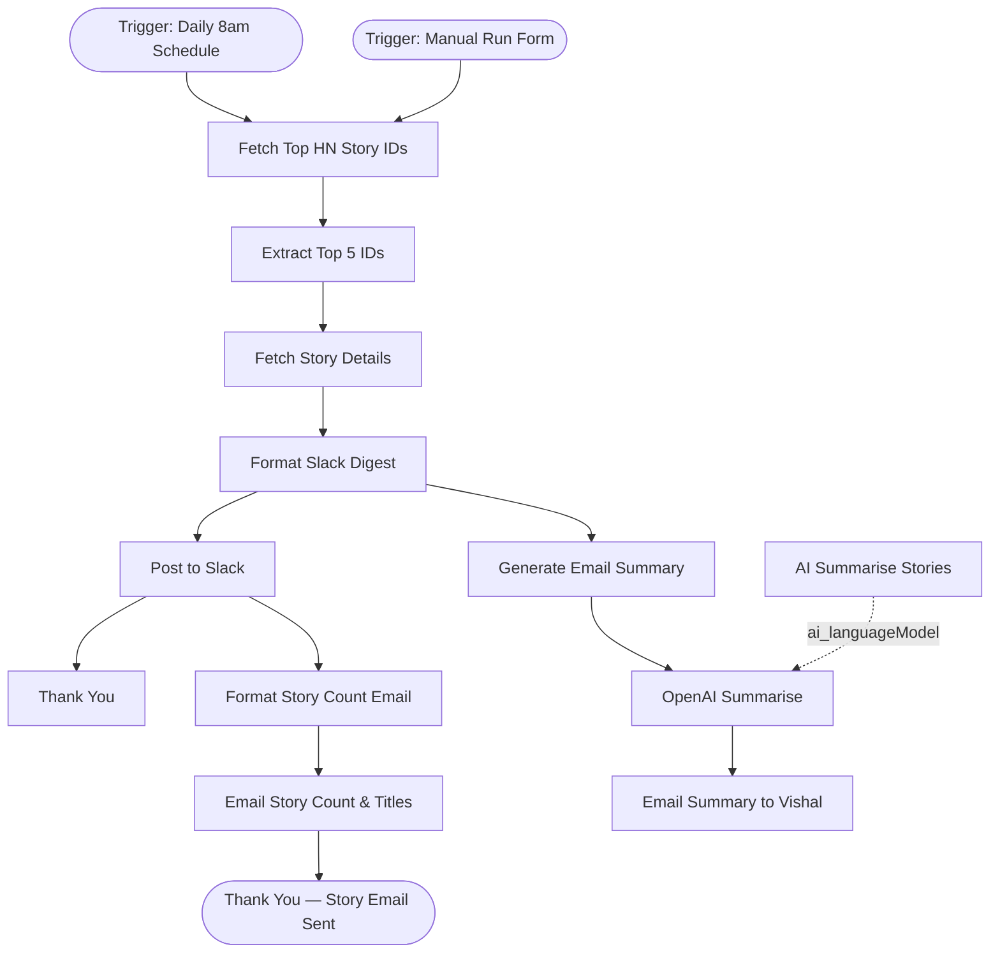

# context.md — Content - HN Digest - Slack

## Purpose
Saves the Engineering team from manually checking Hacker News each morning by automatically fetching the top 5 stories, posting a formatted digest to Slack, emailing a ranked story count summary to Vishal Mishra, and sending an AI-generated editorial summary via Gmail.

## What It Does
1. The schedule trigger fires every day at 8am automatically. Alternatively, a manual run form can be submitted to trigger the digest on demand.
2. An HTTP request fetches the ranked list of top story IDs from the public Hacker News API — no authentication required.
3. A code step extracts the first 5 IDs and builds individual API URLs for each story.
4. A second HTTP request fetches the full details (title, URL, score, author) for each of the 5 stories.
5. A code step formats all 5 stories into a Slack-ready message with clickable links, scores, and author names.
6. The Slack node posts the formatted digest to the #general channel.
7. In parallel from the Slack post, a code step sorts the fetched stories by score (highest first) and builds an HTML table showing the story count, titles, scores, and authors ranked by importance and reliability.
8. A Gmail node sends that ranked HTML table to vishalm.mishra@fulcrumapp.com with a subject line showing exactly how many stories were fetched.
9. A thank you completion screen is shown confirming both the Slack post and the story count email went out.
10. On the original form-triggered path, the existing thank you screen is shown to the person who submitted the form.
11. In parallel from Format Slack Digest, a second code step prepares the story list as plain text for the AI summariser.
12. An OpenAI agent (gpt-5-mini) generates a concise 3–5 sentence summary of the day's top stories.
13. A second Gmail node sends the AI summary as an HTML email to vishalm.mishra@fulcrumapp.com.

## Workflow Diagram

> Diagram fully re-derived from workflow node graph at submission time.

## Tools & Connectors Used
| Tool / Service | How It's Used |
|---|---|
| Hacker News API | Public REST API — fetches the ranked top story ID list and individual story details (title, URL, score, author). No credentials required. |
| Slack | Receives the formatted digest message and posts it to the #general channel via the owner's personal OAuth2 connection. |
| OpenAI | gpt-5-mini model generates a concise 3–5 sentence editorial summary of the top 5 stories. Uses shared n8n OpenAI API credits. |
| Gmail | Two sends: (1) a ranked HTML table of story count and titles sorted by score to vishalm.mishra@fulcrumapp.com; (2) the AI-generated editorial summary as an HTML email to the same address. Both use the owner's Gmail OAuth2 connection. |
| n8n Form | Provides a manual trigger form and displays thank you completion screens once the digest and emails have been sent. |

## Credentials Required
| Credential Name | Service | Notes |
|---|---|---|
| Slack OAuth2 | Slack | Personal OAuth2 credential — scoped to the owner's Slack account for posting messages. |
| n8n free OpenAI API credits | OpenAI | Shared n8n OpenAI credential — auto-assigned. Used by the AI Summarise Stories model node. |
| Gmail account | Gmail | Personal Gmail OAuth2 credential — used for both outbound emails to the owner. |

> ⚠️ Never include credential values — names only.

## KPI Baseline
| Metric | Value |
|---|---|
| Manual time per run (before) | 23 minutes |
| Estimated runs per week | 0.5 (twice a month) |
| Projected hours saved/week | (23 × 0.5) ÷ 60 = **0.19 hours** |

## Risk Self-Assessment
| Risk Type | Present? | Notes |
|---|---|---|
| Handles PII / personal data | No | Only public Hacker News story data is processed. Emails are sent to the workflow owner only. |
| Makes external API calls | Yes | Calls the public Hacker News Firebase API and the OpenAI API. Both are low-risk at this volume. |
| Involves financial data | No | No financial data is touched. |
| Requires human decision point | No | Fully automated end-to-end; manual form path is optional. |
| Shared automation modification | No | Updated version of original build — not a modification of a shared automation owned by another user. |

## Submitter
**Name:** Vishal Mishra
**Email:** vishalm.mishra@fulcrumapp.com
**Date:** 2026-06-22
**n8n Workflow ID:** rnbJkpvSC6pCINB7
**Registry ID:** 2a0fad47-874c-419d-906e-97c807aabfd1
**COE Portal:** https://coe-portal.ai.fulcrum.tools/catalog/2a0fad47-874c-419d-906e-97c807aabfd1
**Instance:** fulcrumtest.app.n8n.cloud
**Source:** Updated — previously approved as content-hackernews-digest-slack