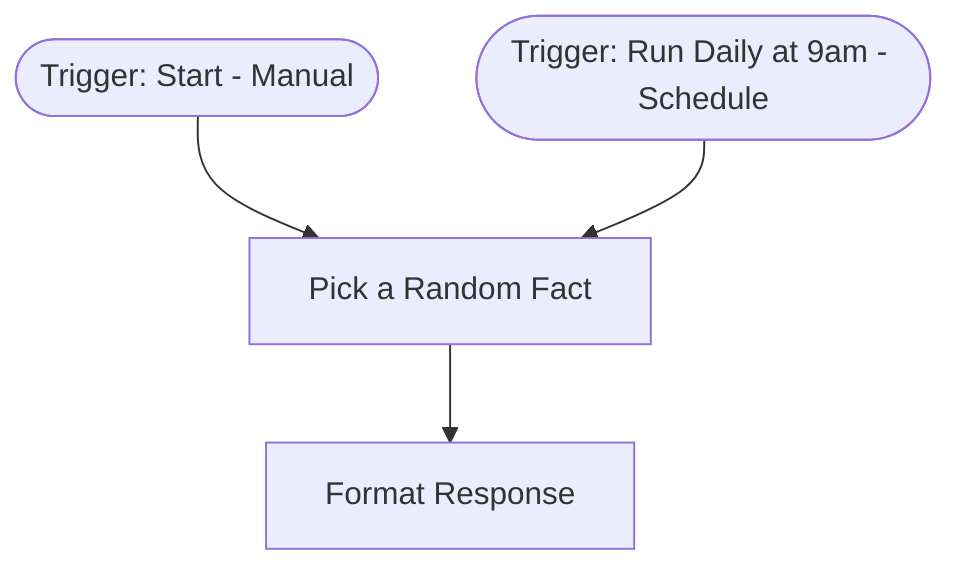

# context.md — Demo - Daily Fact Generator

## Purpose
This workflow demonstrates the end-to-end COE automation pipeline using a self-contained example that requires no external credentials. It picks a random fun fact from a built-in list and returns it as a structured JSON response, serving as a reference build for the Engineering team.

## What It Does
1. Triggered either manually (via the Start button) or automatically on a daily schedule at 9am.
2. The "Pick a Random Fact" step selects a random entry from a hardcoded list of 10 fun facts using JavaScript.
3. It captures the current timestamp and day of the week alongside the chosen fact.
4. The "Format Response" step merges all fields and appends a `status: success` field to produce the final structured output.

## Workflow Diagram

> Diagram auto-generated from workflow node graph at submission time.

## Tools & Connectors Used
| Tool / Service | How It's Used |
|---|---|
| n8n built-in (Code node) | Runs inline JavaScript to select a random fact and generate timestamp metadata |
| n8n built-in (Set node) | Merges upstream fields and appends a `status` field to the output |

## Credentials Required
No credentials required for this workflow. All logic is self-contained within n8n built-in nodes.

## KPI Baseline
| Metric | Value |
|---|---|
| Manual time per run (before) | 2 minutes |
| Estimated runs per week | 7 |
| Projected hours saved/week | (2 × 7) / 60 = 0.23 hours/week |

## Risk Self-Assessment
| Risk Type | Present? | Notes |
|---|---|---|
| Handles PII / personal data | No | No user data processed — static fact list only |
| Makes external API calls | No | All logic is internal to n8n; no outbound HTTP requests |
| Involves financial data | No | No financial data involved |
| Requires human decision point | No | Fully automated, no human input required |
| Shared automation modification | No | Original build — not a modification of an existing shared automation |

## Submitter
**Name:** Vishal Mishra
**Email:** vishalm.mishra@fulcrumapp.com
**Date:** 2026-06-22
**n8n Workflow ID:** rtkqBfxq0DzJ6kC9
**Registry ID:** 58b0a54b-3ab4-424c-b341-43116889744d
**COE Portal:** https://coe-portal.ai.fulcrum.tools/catalog/58b0a54b-3ab4-424c-b341-43116889744d
**Instance:** fulcrumtest.app.n8n.cloud
**Source:** Original