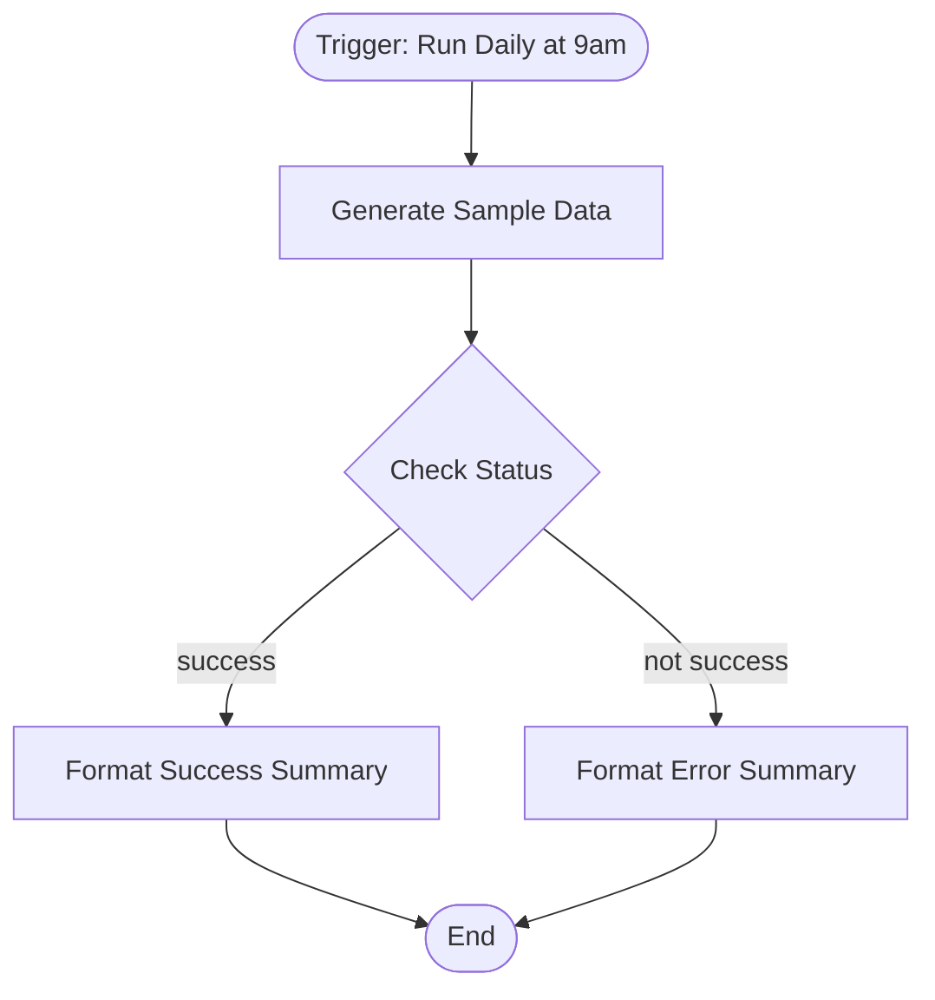

# context.md — Demo - Daily Summary - Engineering

## Purpose
This workflow demonstrates a simple daily automation pattern for the Engineering team. It runs on a schedule, generates a sample data payload, evaluates a status condition, and routes the result into a clearly formatted success or error summary.

## What It Does
1. **Run Daily at 9am** — A schedule trigger fires the workflow every 24 hours automatically.
2. **Generate Sample Data** — Sets a fixed set of fields: report date (current timestamp), number of items processed (42), status (success), and environment (demo).
3. **Check Status** — Evaluates whether the status field equals "success".
4. **Format Success Summary** — If the check passes, appends a human-readable summary and a ✅ result label to the data.
5. **Format Error Summary** — If the check fails, appends a failure message and a ❌ result label instead.

## Workflow Diagram

> Diagram auto-generated from workflow node graph at submission time.

## Tools & Connectors Used
| Tool / Service | How It's Used |
|---|---|
| n8n | Hosts and executes the workflow; provides the schedule trigger, data transformation, and conditional routing nodes |

## Credentials Required
| Credential Name | Service | Notes |
|---|---|---|
| None | — | This workflow requires no external credentials — all data is generated internally |

## KPI Baseline
| Metric | Value |
|---|---|
| Manual time per run (before) | 10 minutes |
| Estimated runs per week | 7 |
| Projected hours saved/week | 1.17 hours |

## Risk Self-Assessment
| Risk Type | Present? | Notes |
|---|---|---|
| Handles PII / personal data | No | All data is synthetic and hardcoded for demo purposes |
| Makes external API calls | No | No external systems are called |
| Involves financial data | No | No financial data is used or produced |
| Requires human decision point | No | Fully automated — no manual step required |
| Shared automation modification | No | This is an original build using personal credential scope |

## Submitter
**Name:** Vishal
**Email:** vishalm.mishra@fulrumapp.com
**Date:** 2026-06-05
**n8n Workflow ID:** xguZZIaZDAG55oTh
**Registry ID:** 1c0b2326-cd73-459a-a02a-475d21b15453
**COE Portal:** https://coe-portal.ai.fulcrum.tools/catalog/1c0b2326-cd73-459a-a02a-475d21b15453
**Instance:** fulcrumtest.app.n8n.cloud
**Source:** Original