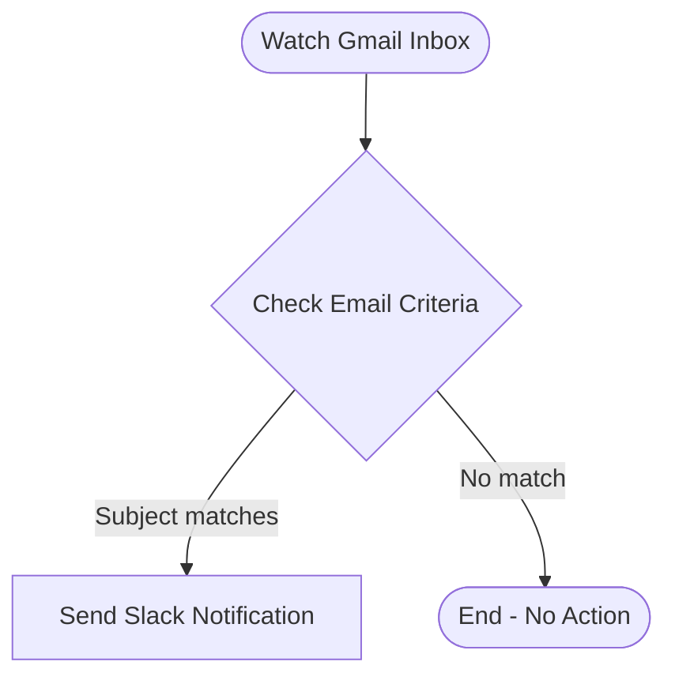

# context.md — Revenue Ops - Email to Slack Notifications

## Purpose
Revenue Ops team members often miss time-sensitive emails that require immediate attention. This workflow ensures that any unread Gmail message with "urgent" or "action required" in the subject is instantly surfaced as a Slack alert in #revenue-ops-alerts, so nothing falls through the cracks.

## What It Does
1. **Watch Gmail Inbox** — Polls the connected Gmail account every minute for new unread emails matching the search filter `subject:(urgent OR "action required")`.
2. **Check Email Criteria** — Evaluates the email subject against two conditions (contains "urgent" OR contains "action required") using a case-insensitive check.
3. **Send Slack Notification** — If the criteria match, posts a formatted alert to the #revenue-ops-alerts Slack channel including the sender, subject line, and a preview snippet of the email body.

Emails that do not match the subject criteria are silently ignored — no Slack message is sent.

## Workflow Diagram

> Diagram derived from workflow node graph at submission time.

## Tools & Connectors Used
| Tool / Service | How It's Used |
|---|---|
| Gmail | Polled every minute to retrieve new unread emails matching the subject filter. Read-only access. |
| Slack | Receives formatted alert messages posted to the #revenue-ops-alerts channel when a matching email is detected. Write-only access. |

## Credentials Required
| Credential Name | Service | Notes |
|---|---|---|
| Gmail OAuth2 | Gmail | Personal Gmail account OAuth2 — read-only scope (gmail.readonly) |
| Slack OAuth2 | Slack | Personal Slack OAuth2 — scopes: chat:write, channels:read |

> ⚠️ Never include credential values — names only.

## KPI Baseline
| Metric | Value |
|---|---|
| Manual time per run (before) | 10 minutes |
| Estimated runs per week | 7 |
| Projected hours saved/week | 1.17 hours |

> Calculation: (10 × 7) / 60 = 1.17 hours/week

## Risk Self-Assessment
| Risk Type | Present? | Notes |
|---|---|---|
| Handles PII / personal data | Yes | Email content (sender address, subject, snippet) is read and forwarded to Slack. Only shared within the #revenue-ops-alerts channel. |
| Makes external API calls | Yes | Calls Gmail API (read) and Slack API (write) on every matching email. |
| Involves financial data | No | No financial data is read or written. |
| Requires human decision point | No | Fully automated — no human approval step in the workflow. |
| Shared automation modification | No | Uses personal credentials — this is an owner-only automation. |

## Submitter
**Name:** Gaurav Shakya
**Email:** gaurav.shakya@fulcrumapp.com
**Date:** 2026-06-12
**n8n Workflow ID:** TYV8qCYaLSs1xzdL
**Registry ID:** d8545a1e-2d5f-45c0-a2e1-8c622fbe03f2
**COE Portal:** https://coe-portal.ai.fulcrum.tools/catalog/d8545a1e-2d5f-45c0-a2e1-8c622fbe03f2
**Instance:** fulcrumtest.app.n8n.cloud
**Source:** Original
